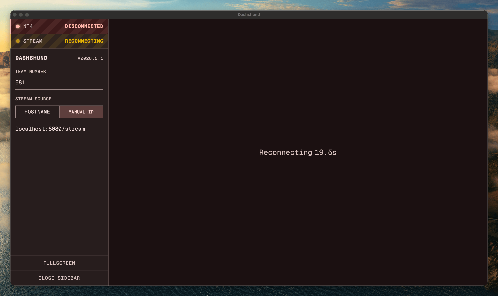

# Dashshund

FRC dashboard for viewing camera streams for [Team 581](https://team581.com/). Built with Electron, SolidJS, and Tailwind CSS.

Connects to the robot via NetworkTables (NT4) and displays camera streams.



## Installing

Install with Brew:

```sh
brew install jonahsnider/frc/dashshund
```

Or you can download the latest release from the [GitHub releases page](https://github.com/jonahsnider/dashshund/releases/latest).

## Development

```sh
# Install dependencies
bun install
# Run the dev server
bun run dev

# Run a full build
bun run build
# Preview the built app
bun run preview

# Package the app into a native executable
bun run package
```
